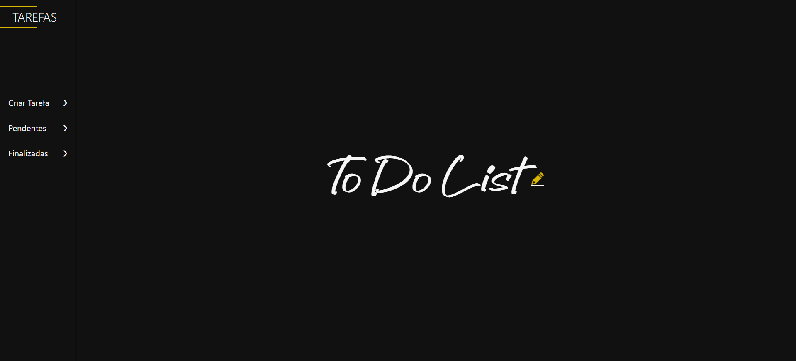

# 📝 To Do List - Lista de Tarefas

Este é um projeto de uma aplicação web de lista de tarefas (To Do List), com foco em usabilidade, design moderno e funcionalidades intuitivas. Totalmente em **HTML, CSS e JavaScript puro**, a lista é armazenada no **`localStorage`** do navegador, o que garante que as tarefas permaneçam mesmo após recarregar a página.

🔗 Acesse a aplicação: [https://todolistprojeto.netlify.app/](https://todolistprojeto.netlify.app/)

## 🖼️ Preview



## 🚀 Funcionalidades

- ✅ Criar novas tarefas
- 🛠️ Editar tarefas existentes
- 🗑️ Finalizar e restaurar tarefas
- ♻️ Excluir todas as tarefas finalizadas
- 🔃 Reordenar tarefas pendentes com **drag-and-drop**
- 🧠 Feedbacks visuais com **toast messages**
- 💾 Dados salvos localmente via `localStorage`

## 📸 Interface

A interface possui:
- Um menu lateral com animações nas setas
- Modal flutuante para criar, visualizar, editar e excluir tarefas
- Responsividade para diferentes tamanhos de tela
- Estilo escuro com detalhes em amarelo

## 🧑‍💻 Tecnologias utilizadas

- HTML5
- CSS3 (com animações e responsividade)
- JavaScript (DOM, eventos, `localStorage`, drag-and-drop)

## 📂 Estrutura de Pastas

```
📁 projeto-to-do-list/
├── 📁 font/
│   └── Handuk.otf
├── 📁 img/
│   ├── check.png
│   ├── delete.png
│   ├── info.png
│   └── lapis.png
├── index.html
├── style.css
└── script.js
```

## ℹ️ Observações

- O `localStorage` é específico por navegador e dispositivo. Tarefas criadas em um navegador não aparecem em outro.
- Se quiser limpar as tarefas, use o botão de exclusão de finalizadas ou limpe o `localStorage` manualmente.

## 📜 Licença

Este projeto é de uso livre para fins pessoais e educacionais.

## 🙋‍♂️ Autor

**Juliano Reis**  
Projeto pessoal criado com fins de aprendizado e prática de desenvolvimento web front-end.
